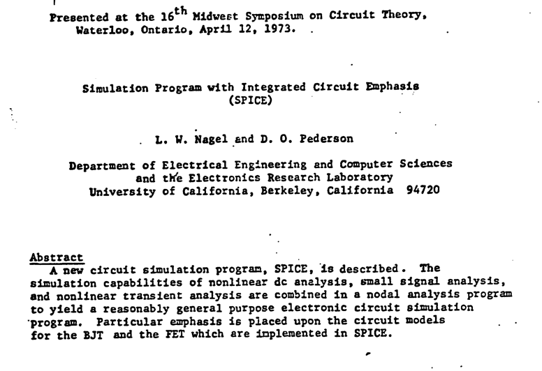
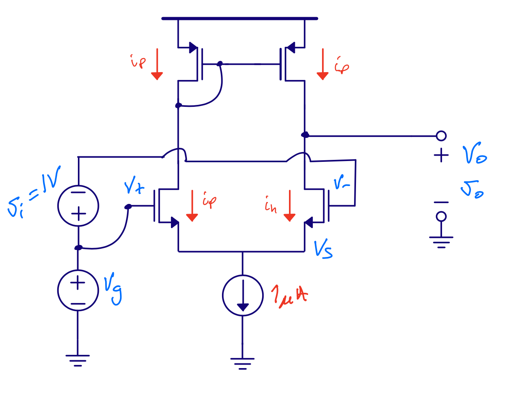
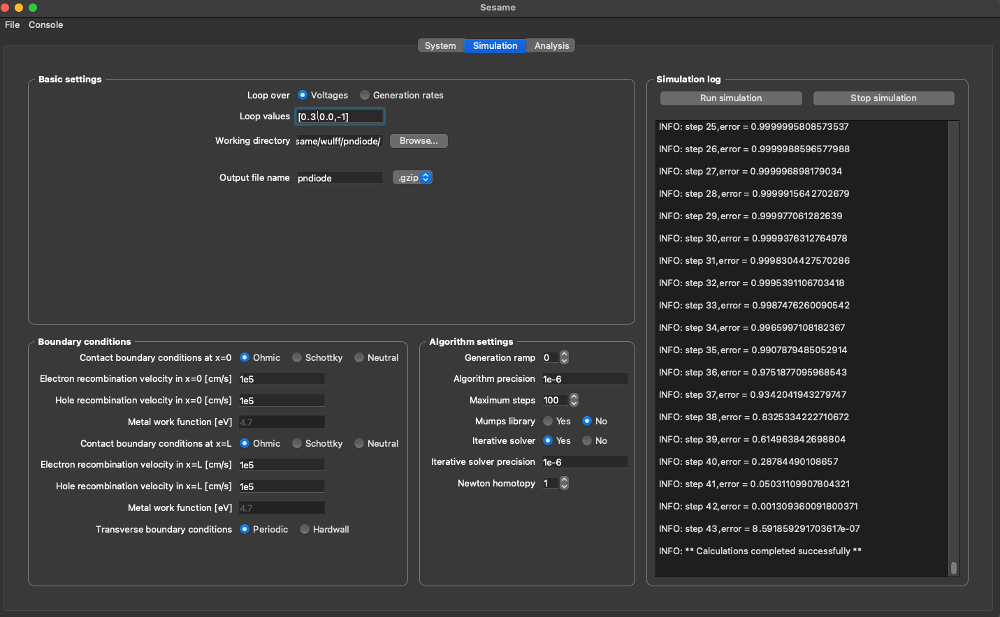

footer: Carsten Wulff 2021
slidenumbers:true
autoscale:true
theme: Plain Jane, 1
text:  Helvetica
header:  Helvetica

## TFE4152 - Lecture 10
# SPICE

## [Source](https://github.com/wulffern/dic2021/blob/main/lectures/l10_spice.md)

---

| Week | Book                    | Monday                                                                    | Book                    | Friday                               |
|------|-------------------------|---------------------------------------------------------------------------|-------------------------|--------------------------------------|
| 34   |                         | Introduction, what are we going to do in this course. Why do you need it? | WH 1 , WH 15            | Manufacturing of integrated circuits |
| 35   | CJM 1.1                 | pn Junctions                                                              | CJM 1.2 WH 1.3, 2.1-2.4 | Mosfet transistors                   |
| 36   | CJM 1.2 WH 1.3, 2.1-2.4 | Mosfet transistors                                                        | CJM 1.3 - 1.6           | Modeling and passive devices         |
| 37   |                         | Guest Lecture - Sony                                                      | CJM 3.1, 3.5, 3.6       | Current mirrors                      |
| 38   | CJM 3.2, 3.3,3.4 3.7    | Amplifiers                                                                | CJM, CJM 2 WH 1.5   | **SPICE simulation**         |
| 39   |                         | Verilog                                                                   |                         | Verilog                              |
| 40   | WH 1.4 WH 2.5           | CMOS Logic                                                                | WH 3                    | Speed                                |
| 41   | WH 4                    | Power                                                                     | WH 5                    | Wires                                |
| 42   | WH 6                    | Scaling Reliability and Variability                                       | WH 8                    | Gates                                |
| 43   | WH 9                    | Sequencing                                                                | WH 10                   | Datapaths - Adders                   |
| 44   | WH 10                   | Datapaths - Multipliers, Counters                                         | WH 11                   | Memories                             |
| 45   | WH 12                   | Packaging                                                                 | WH 14                   | Test                                 |
| 46   |                         | Guest lecture - Nordic Semiconductor                                      |                         |                                      |
| 47   | CJM                     | Recap of CJM                                                              | WH                      | Recap of WH                          |

---
# Goal for today

Introduction to SPICE

Current Mirror Demo

Differential Pair Demo

(If time: [Sesame Demo](https://sesame.readthedocs.io/en/latest/index.html))

---

# Simulation Program with Integrated Circuit Emphasis (SPICE)

Published in 1973 by Nagel and Pederson

*SPICE (Simulation Program with Integrated Circuit Emphasis)*

[https://www2.eecs.berkeley.edu/Pubs/TechRpts/1973/ERL-m-382.pdf](https://www2.eecs.berkeley.edu/Pubs/TechRpts/1973/ERL-m-382.pdf)



---
# Today

[.column]
**Commercial**
[Cadence Spectre](https://www.cadence.com/ko_KR/home/tools/custom-ic-analog-rf-design/circuit-simulation/spectre-simulation-platform.html)
[Siemens Eldo](https://eda.sw.siemens.com/en-US/ic/eldo/)
[Synopsys HSPICE](https://www.synopsys.com/implementation-and-signoff/ams-simulation/primesim-hspice.html)

[.column]
**Free**
[Aimspice](http://aimspice.com)
[Analog Devices LTspice](https://www.analog.com/en/design-center/design-tools-and-calculators/ltspice-simulator.html)

**Open Source**
[ngspice](http://ngspice.sourceforge.net)

---
# But

Pretty much the same usage model as 48 years ago

    <spice program> testbench.cir
    
for example

    aimspice testbench.cir
    
Or in the most expensive analog tool (Cadence Spectre)

     spectre  input.scs  +escchars +log ../psf/spectre.out 
      -format psfxl -raw ../psf   +aps +lqtimeout 900 -maxw 5 -maxn 5 -env ade  -ahdllibdir 
      /tmp/wulff/virtuoso/TB_SUN_BIAS_GF130N/TB_SUN_BIAS/maestro/results/maestro/Interactive.15/sharedData/CDS/ahdl/input.ahdlSimDB 
      +logstatus 

---

The expensive tools have built graphical user interface around the SPICE simulator to make it easier to run many times. Simplifies running multiple PVT corners (maybe 320 simulations).

| Corner | Typical | Fast | Slow | All |
|:---|:---|:---|:---|:---|
|Mosfet| Mtt | Mff| Mss | Mff,Mfs,Msf,Mss|
|Resistor |Rt |Rl | Rh | Rl,Rh|
|Capacitors| Ct| Cl |Ch | Cl,Ch|
|Diode| Dt| Df | Ds | Df,Ds|
|Bipolar| Bt | Bf|Bs|Bf,Bs|
|Temperature| Tt | Th,Tl | Th,Tl | Th,Tl|
|Voltage| Vt | Vh,Vl | Vh,Vl| Vh,Vl|


---

#[fit] SPICE

---
# Sources

[.column]

### Independent current sources

<sub>Infinite output impedance, changing voltage does not change current</sub>

```
I<name> <from> <to> dc <number> ac <number>

I1 0 VDN dc In
I2 VDP 0 dc Ip

```


[.column]

### Independent voltage source 

<sub>Zero output impedance, changing current does not change voltage</sub>

```
V<name> <+> <-> dc <number> ac <number>

V2 VSS 0 dc 0
V1 VDD 0 dc 1.5

```

---

# Passives

[.column]

Resistors

```
R<name> <node 1> <node 2> <value>

R1 N1 N2 10k
R2 N2 N3 1Meg
R3 N3 N4 1G
R4 N4 N5 1T
```

[.column]

Capacitors

```
C<name> <node 1> <node 2> <value>

C1 N1 N2 1a
C2 N1 N2 1f
C4 N1 N2 1p
C3 N1 N2 1n
C5 N1 N2 1u

```

---

# Transistors

Needs a model file the transistor model

BSIM (Berkeley Short-channel IGFET Model)
[http://bsim.berkeley.edu/models/bsim4/](http://bsim.berkeley.edu/models/bsim4/)

---


284 parameters in [BSIM 4.5](http://www-device.eecs.berkeley.edu/~bsim/Files/BSIM4/BSIM480/BSIM480_Manual.pdf)

```ruby
.MODEL N1 NMOS LEVEL=14 VERSION=4.5.0 BINUNIT=1 PARAMCHK=1 MOBMOD=0
CAPMOD=2 IGCMOD=1 IGBMOD=1 GEOMOD=1  DIOMOD=1 RDSMOD=0 RBODYMOD=0 RGATEMOD=3
PERMOD=1 ACNQSMOD=0 TRNQSMOD=0 TEMPMOD=0  TNOM=27 TOXE=1.8E-009
TOXP=10E-010 TOXM=1.8E-009  DTOX=8E-10 EPSROX=3.9 WINT=5E-009 LINT=1E-009
LL=0 WL=0 LLN=1 WLN=1  LW=0 WW=0 LWN=1 WWN=1  LWL=0 WWL=0 XPART=0
TOXREF=1.4E-009  SAREF=5E-6 SBREF=5E-6 WLOD=2E-6 KU0=-4E-6  KVSAT=0.2
KVTH0=-2E-8 TKU0=0.0 LLODKU0=1.1  WLODKU0=1.1 LLODVTH=1.0 WLODVTH=1.0
LKU0=1E-6  WKU0=1E-6 PKU0=0.0 LKVTH0=1.1E-6 WKVTH0=1.1E-6  PKVTH0=0.0
STK2=0.0 LODK2=1.0 STETA0=0.0  LODETA0=1.0  LAMBDA=4E-10  VSAT=1.1E 005
VTL=2.0E5 XN=6.0 LC=5E-9  RNOIA=0.577 RNOIB=0.37
LINTNOI=1E-009  WPEMOD=0 WEB=0.0 WEC=0.0 KVTH0WE=1.0  K2WE=1.0 KU0WE=1.0
SCREF=5.0E-6  TVOFF=0.0 TVFBSDOFF=0.0  VTH0=0.25  K1=0.35 K2=0.05
K3=0  K3B=0 W0=2.5E-006 DVT0=1.8 DVT1=0.52  DVT2=-0.032 DVT0W=0 DVT1W=0
DVT2W=0  DSUB=2 MINV=0.05 VOFFL=0 DVTP0=1E-007  DVTP1=0.05 LPE0=5.75E-008
LPEB=2.3E-010 XJ=2E-008  NGATE=5E 020 NDEP=2.8E 018 NSD=1E 020 PHIN=0
CDSC=0.0002 CDSCB=0 CDSCD=0 CIT=0  VOFF=-0.15 NFACTOR=1.2 ETA0=0.05
ETAB=0  UC=-3E-011  VFB=-0.55 U0=0.032 UA=5.0E-011 UB=3.5E-018  A0=2
AGS=1E-020 A1=0 A2=1 B0=-1E-020 B1=0  KETA=0.04 DWG=0 DWB=0 PCLM=0.08
PDIBLC1=0.028 PDIBLC2=0.022 PDIBLCB=-0.005 DROUT=0.45  PVAG=1E-020
DELTA=0.01 PSCBE1=8.14E 008 PSCBE2=5E-008  RSH=0 RDSW=0 RSW=0 RDW=0
FPROUT=0.2 PDITS=0.2 PDITSD=0.23 PDITSL=2.3E 006  RSH=0 RDSW=50 RSW=150
RDW=150  RDSWMIN=0 RDWMIN=0 RSWMIN=0 PRWG=0  PRWB=6.8E-011 WR=1
ALPHA0=0.074 ALPHA1=0.005  BETA0=30 AGIDL=0.0002 BGIDL=2.1E 009 CGIDL=0.0002
EGIDL=0.8  AIGBACC=0.012 BIGBACC=0.0028 CIGBACC=0.002  NIGBACC=1
AIGBINV=0.014 BIGBINV=0.004 CIGBINV=0.004  EIGBINV=1.1 NIGBINV=3 AIGC=0.012
BIGC=0.0028  CIGC=0.002 AIGSD=0.012 BIGSD=0.0028 CIGSD=0.002  NIGC=1
POXEDGE=1 PIGCD=1 NTOX=1  VFBSDOFF=0.0  XRCRG1=12 XRCRG2=5  CGSO=6.238E-010
CGDO=6.238E-010 CGBO=2.56E-011 CGDL=2.495E-10  CGSL=2.495E-10
CKAPPAS=0.03 CKAPPAD=0.03 ACDE=1  MOIN=15 NOFF=0.9 VOFFCV=0.02  KT1=-0.37
KT1L=0.0 KT2=-0.042 UTE=-1.5  UA1=1E-009 UB1=-3.5E-019 UC1=0 PRT=0
AT=53000  FNOIMOD=1 TNOIMOD=0  JSS=0.0001 JSWS=1E-011 JSWGS=1E-010 NJS=1
IJTHSFWD=0.01 IJTHSREV=0.001 BVS=10 XJBVS=1  JSD=0.0001 JSWD=1E-011
JSWGD=1E-010 NJD=1  IJTHDFWD=0.01 IJTHDREV=0.001 BVD=10 XJBVD=1  PBS=1 CJS=0.0005
MJS=0.5 PBSWS=1  CJSWS=5E-010 MJSWS=0.33 PBSWGS=1 CJSWGS=3E-010  MJSWGS=0.33
PBD=1 CJD=0.0005 MJD=0.5  PBSWD=1 CJSWD=5E-010 MJSWD=0.33 PBSWGD=1
CJSWGD=5E-010MJSWGD=0.33 TPB=0.005 TCJ=0.001 TPBSW=0.005 TCJSW=0.001 TPBSWG=0.005
TCJSWG=0.001  XTIS=3 XTID=3  DMCG=0E-006 DMCI=0E-006 DMDG=0E-006 DMCGT=0E-007  DWJ=0.0E-008 XGW=0E-007
XGL=0E-008  RSHG=0.4 GBMIN=1E-010 RBPB=5 RBPD=15  RBPS=15 RBDB=15 RBSB=15 NGCON=1
JTSS=1E-4 JTSD=1E-4 JTSSWS=1E-10 JTSSWD=1E-10 JTSSWGS=1E-7 JTSSWGD=1E-7  NJTS=20.0
NJTSSW=20 NJTSSWG=6 VTSS=10 VTSD=10 VTSSWS=10 VTSSWD=10  VTSSWGS=2 VTSSWGD=2
XTSS=0.02 XTSD=0.02 XTSSWS=0.02 XTSSWD=0.02 XTSSWGS=0.02 XTSSWGD=0.02
```	   
---

# Transistors

```

M<name> <drain> <gate> <source> <bulk> <modelname> [parameters]


.include ../../models/ptm_130.spi
M1 VDN VDN VSS VSS nmos W=0.6u L=0.15u
M2 VDP VDP VDD VDD pmos W=0.6u L=0.15u


```

---
# Predictive technology models (PTM 0.13 um)

TFE4152 use [Predictive Technology Models](http://ptm.asu.edu)

"Fictional" models, but that may be close to reality if the right foundry is chosen


---

## Analog Design

1. **Define the problem, what are you trying to solve?**
1. **Find a circuit that can solve the problem (papers, books)**
1. **Find right transistor sizes. What transistors should be weak inversion, strong inversion, or don't care?**
1. **Check operating region of transistors (.op)**
1. **Check key parameters (.dc, .ac, .tran)**
1. **Check function. Exercise all inputs. Check all control signals**
1. Check key parameters in all corners. Check mismatch (Monte-Carlo simulation)
1. Do layout, and check it's error free. Run design rule checks (DRC). Check layout versus schematic (LVS)
1. Extract parasitics from layout. Resistance, capacitance, and inductance if necessary.
1. On extracted parasitic netlist, check key parameters in all corners and mismatch (if possible).
1. If everything works, then your done.

*On failure, go back*

---


# Find right transistor sizes

Assume active ($$V_{ds} > V_{eff}$$ in strong inversion, or $$V_{ds} > 3 V_T$$ in weak inversion). For diode connected transistors, that is always true.

Weak inversion: 
$$ I_{D} = I_{D0} \frac{W}{L} e^{V_eff / n V_T} $$, $$V_{eff} \propto \ln{I_D} $$

Strong inversion: 
$$ I_{D} = \frac{1}{2} \mu_n C_{ox} \frac{W}{L} V_{eff}^2$$, $$V_{eff} \propto \sqrt{I_D} $$

**Operating region for a diode connected transistor only depends on the current**


---

[dicex/lectures/l10/op.cir](https://github.com/wulffern/dicex/blob/main/lectures/l10/op.cir)

- Force a current through a diode connect transistor
- Check the $$V_{eff}$$
- aimspice: Vgt or inversion coefficient (IC) 


---
# A useful unit, $$\mu A/\square $$

[.column]
$$\square = W/L$$

$$ \mu A = \frac{\mu A}{\square} \times W/L$$

[.column]
Assume a transistor with $$W= 10 L$$ and $$L = 0.15 \mu m$$ has a current of $$100 \mu A$$

Then the $$\mu A/\square \Rightarrow \frac{100 \mu A}{W/L} = \frac{ 100 \mu A }{10}  = 10 \mu A /\square$$

Assume you need $$ 1000 \mu A$$, then you need $$\square = W/L = 100$$ 

---

# Use unit size transistors for analog design

 $$ W/L \approx \in[4, 6, 10] $$, but should have space for two contacts
 
Use parallell transistors for larger W/L

Amplifiers $$\Rightarrow L \approx 1.2 \times L_{min} $$

Current mirrors $$\Rightarrow L \approx 4 \times L_{min} $$

Choose sizes that have been used by foundry for measurement to match SPICE model

---

# $$ L = 0.13 \text{ um} \times 1.2 \approx  0.15\text{ um}$$

    aimspice op.cir 
    aimspice op.cir && cat op.log|grep -e Device -e IC  -e "Vgs " -e Id -e Vgt

---

# $$ L = 0.15\text{ um}$$
  
[.column]
## NMOS

| Inversion | uA/sq | Vgs  |
| ---       | ---:       | ---:  |
| Weak      | 0.2       | 0.25 |
| Moderate  | 1.5       | 0.34 |
| Strong    | 8         | 0.46 |

[.column]
## PMOS

| Inversion | uA/sq | Vgs |
| ---| ---:| ---:| 
| Weak |  0.03 | -0.22 |
| Moderate |  0.25 | -0.3 |
| Strong | 1.3 | -0.4 |

---

# $$ L = 0.13 \text{ um} \times 4 \approx  0.5\text{ um}$$

    aimspice op_long.cir && cat op_long.log|grep -e Device -e IC  -e "Vgs " -e Id -e Vgt
---
# $$ L = 0.5\text{ um}$$

[.column]
## NMOS

| Inversion | uA/sq | Vgs|
| ---| ---:| ---: |
| Weak | 0.1 | 0.25|
| Moderate | 1.2 | 0.38|
| Strong | 6 | 0.48|

[.column]
## PMOS
| Inversion | uA/sq | Vgs |
| ---| ---:| ---:| 
| Weak |  0.016 | -0.23|
| Moderate |  0.2 | -0.34|
| Strong | 1 | -0.45|

---

# For same $$|V_{eff}|$$ there is a factor 6 between NMOS and PMOS in PTM 0.13 um

---

# What about gm/Id ?

Weak $$ \frac{g_m}{I_d} = \frac{1}{nV_T}$$

Strong $$ \frac{g_m}{I_d} = \frac{2}{V_{eff}}$$

    aimspice -o csv gm.cir &&python3 ../../py/plot.py gm.csv "i1" "v(gmid_weak),v(gmid_strong),v(gmid)" "same"
    aimspice -o csv gm_cs_long.cir &&python3 ../../py/plot.py gm_cs_long.csv "vgsteff(m1)" "v(gmid_weak),v(gmid_strong),v(gmid)" "same"
---

# What about gm/Id ?

[.column]
Weak inversion, pretty close

Strong inversion, about a factor 2 off, but close enough.

[.column]


    gm.cir

---

#[fit] Current mirror

---

# Problem statement: I need bias currents of $$ [2,4,8] \mu A$$ from a $$ 1 \mu A$$ current.

---


---


Current mirror, NMOS transistors: $$ L = 0.5 um$$

Strong inversion: $$6 \mu A/\square$$

Input current: $$1 \text{ }\mu A$$

Squares: $$ W/L = 1/6$$

Width: $$ W = 1/6 \times 0.5 \approx 0.083 um \Rightarrow$$ **Illegal size**

**Option 1:**
Make L longer (but then we don't have unit transistors)

**Option 2:**
Connect transistors in series (Not exactly the same, but OK)

Assume $$ W = 0.5 um$$, then 6 transistors stacked should give us strong inversion for 1 uA


---
# Stacked transistors
    
    op_stack.cir
    aimspice op_stack.cir&& cat op_stack.log |grep -e Device -e Vgt -e Is
    
---
# Current mirror

```ruby
.subckt NCHCM D G S B w=0.5u l=0.5u
M1 D G N1 B nmos W=w L=l
M2 N1  G N2 B nmos W=w L=l
M3 N2  G N3 B nmos W=w L=l
M4 N3  G N4 B nmos W=w L=l
M5 N4  G N5 B nmos W=w L=l
M6 N5  G S B nmos W=w L=l
.ends

.subckt CMIRR VDN IDN1 IDN2 IDN3 VSS
XM0 VDN VDN VSS VSS NCHCM

XM1a IDN1 VDN VSS VSS NCHCM
XM1b IDN1 VDN VSS VSS NCHCM

XM2a IDN2 VDN VSS VSS NCHCM
XM2b IDN2 VDN VSS VSS NCHCM
XM2c IDN2 VDN VSS VSS NCHCM
XM2d IDN2 VDN VSS VSS NCHCM

XM3a IDN3 VDN VSS VSS NCHCM
XM3b IDN3 VDN VSS VSS NCHCM
XM3c IDN3 VDN VSS VSS NCHCM
XM3d IDN3 VDN VSS VSS NCHCM
XM3e IDN3 VDN VSS VSS NCHCM
XM3f IDN3 VDN VSS VSS NCHCM
XM3g IDN3 VDN VSS VSS NCHCM
XM3h IDN3 VDN VSS VSS NCHCM
.ends
```


---
# Current mirror - Demo
    
    cm.cir
    cm_op_tb.cir
    cm_ac_ro_tb.cir
    cm_ac_gain_tb.cir
    
    aimspice cm_op_tb.cir 
    aimspice -o csv cm_ac_ro_tb.cir 
    python3 ../../py/plot.py "Frequency" "ir(vo1),ir(vo2),ir(vo3)" "logx"
    python3 ../../py/plot.py cm_ac_gain_tb.csv "Frequency" "im(e1),im(e2),im(e3)" "same"

---

#[fit] Diffpair <sub><sub>really an Operational transconductance amplifier</sub></sub>
---

# Problem statement: I need to copy a voltage with a DC gain of 1

---

# Solution: Unity gain feedback OTA


---

Bias current $$I = 1\text{ } \mu A$$, $$I_p = I_n = 0.5\text{ } \mu A $$

**Diffpair, NMOS** $$ L = 0.15 um$$
Weak inversion: $$0.2 \mu A/\square$$
$$W/L = \frac{0.5 \mu A}{0.2 \mu A/\square} = 2.5 \square $$
$$W \approx 0.5 \mu m$$

**Current Mirror, NMOS** $$ L = 0.5 \mu m$$
Strong inversion $$ 1 \mu A/\square$$
Reuse our NCHCM

**Current mirror, PMOS** $$ L = 0.5 \mu um$$
1/6'th the $$\square$$ of NMOS.
$$ W = 0.5 \mu m$$




---

    ota.cir
    ota_op_tb.cir
    aimspice ota_op_tb.cir 
    cat ota_op_tb.log |grep -e Device -e Vgt -e IC
    cat ota_op_tb.log |grep -e Device -e Gm -e Rds
    
    ota_ac_tb.cir
    aimspice -o csv ota_ac_tb.cir 
    python3 ../../py/plot.py ota_ac_tb.csv "Frequency" "vdb(vo),vp(vo)" "logx"
    
    ota_cl_tb.cir
    python3 ../../py/plot.py ota_cl_tb.csv "Frequency" "vdb(vo),vp(vo)" "logx"

    


---
# More information

[Aimspice Manual](http://www.aimspice.com/downloads/aimspiceref.2020.100.pdf)
[Ngspice Manual](http://ngspice.sourceforge.net/docs/ngspice-34-manual.pdf)

Chapter 7 in Weste

---
#[fit] Sesame 

---

Sesame is a Python3 package for solving the drift diffusion Poisson equations for multi-dimensional systems using finite differences.

[Install instructions](https://sesame.readthedocs.io/en/latest/pre/INSTALL_beginner.html)


<sub>Semiconductor current-flow equations (diffusion and degeneracy), R.Stratton,
IEEE Transactions on Electron Devices
[https://ieeexplore.ieee.org/document/1477063](https://ieeexplore.ieee.org/document/1477063)</sub>


---


---



---


---

#[fit] Thanks!


