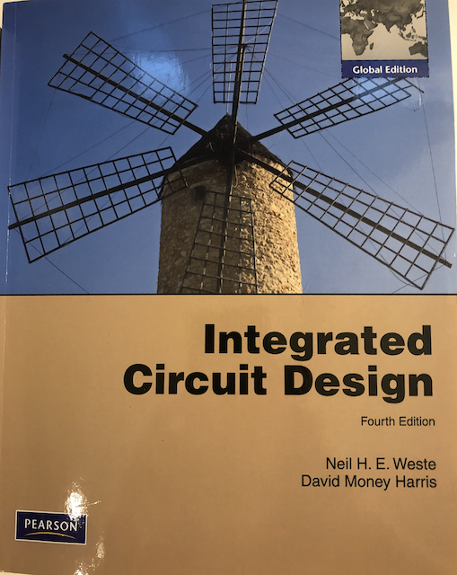
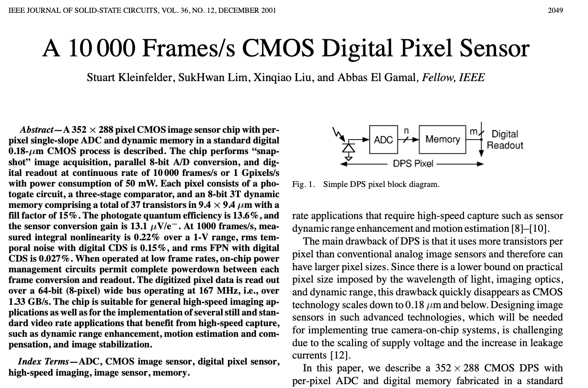
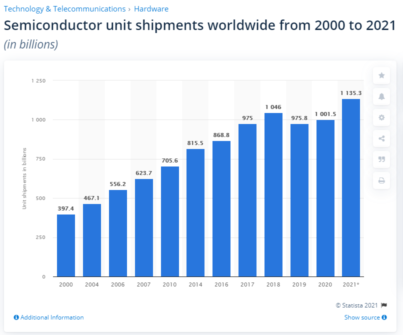

footer: Carsten Wulff 2021
slidenumbers:true
autoscale:true
theme: Plain Jane, 1
text:  Helvetica
header:  Helvetica
    
## TFE4152 - Lecture 1 
# Design of Integrated Circuits

---

# Goal for today
* Who are we
* Introduce Course
* Introduce Exercises
* Introduce Project
* Introduce Software
* Try to convince you why you should learn about ICs
* Introduce how we're going to learn it
* Why do we make ICs?
* Introduce what skills you'll learn 

---

#[fit] Who

---

# Carsten Wulff [carstenw@ntnu.no](carstenw@ntnu.no)


---

# Teaching assistants

- Ehsan Lari
- Erlend Kristiansen Berg
- Jonas Gjendem Røysland 

---

#[fit] Course

---

# [Description](https://www.ntnu.no/studier/emner/TFE4152#tab=omEmnet)
# [Time schedule] (https://tp.uio.no/ntnu/timeplan/?id=TFE4152&sem=21h&sort=form&type=course)

---


[.column]


[.column]


---

# [Curriculum](https://github.com/wulffern/dicex/blob/main/book/icd.md)

---

# Lecture plan

| Week | Book                    | Monday                                                                    | Book                    | Friday                               |
|------|-------------------------|---------------------------------------------------------------------------|-------------------------|--------------------------------------|
| 34   |                         | Introduction, what are we going to do in this course. Why do you need it? | WH 1                    | Manufacturing of integrated circuits |
| 35   | CJM 1.1                 | pn Junctions                                                              | CJM 1.2 WH 1.3, 2.1-2.4 | Mosfet transistors                   |
| 36   | CJM 1.2 WH 1.3, 2.1-2.4 | Mosfet transistors                                                        | CJM 1.3 - 1.6           | Modeling and passive devices         |
| 37   | CJM 2 WH 1.5 WH 15      | Guest Lecture - Sony                                                      | CJM 3.1, 3.5, 3.6       | Current mirrors                      |
| 38   | CJM 3.2, 3.3,3.4 3.7    | Amplifiers                                                                | CJM                     | SPICE simulation                     |
| 39   |                         | Layout                                                                    |                         | Verilog                              |
| 40   | WH 1.4 WH 2.5           | CMOS Logic                                                                | WH 3                    | Speed                                |
| 41   | WH 4                    | Power                                                                     | WH 5                    | Wires                                |
| 42   | WH 6                    | Scaling Reliability and Variability                                       | WH 8                    | Gates                                |
| 43   | WH 9                    | Sequencing                                                                | WH 10                   | Datapaths - Adders                   |
| 44   | WH 10                   | Datapaths - Multipliers, Counters                                         | WH 11                   | Memories                             |
| 45   | WH 12                   | Packaging                                                                 | WH 14                   | Test                                 |
| 46   |                         | Guest lecture - Nordic Semiconductor                                      |                         |                                      |
| 47   | CJM                     | Recap of CJM                                                              | WH                      | Recap of WH                          |

---

# Exam

- December 2021?
- 4 hours
- D aids code - No handwritten or printed aids allowed. Preapproved calculator, in accordance to the exam regulations,
  allowed
- 70% of the final grade
- A - F grade (F = Fail)

---

#[fit] Exercise

---

# Facts
- 6 exercises on blackboard (somewhat modified from last year)
- last years exercise and solutions on blackboard
- must have 4 of 6 exercises approved
- strict deadline (Friday XX 23:59)
- no second chances

---

# Plan 

| Date       | Week | Topic                          |
| ---        | ---  | ---                            |
| 2021-09-10 | 36   | PN Junctions                   |
| 2021-09-24 | 38   | Transistors                    |
| 2021-10-08 | 40   | Current Mirrors and Amplifiers |
| 2021-10-22 | 42   | CMOS logic                     |
| 2021-11-05 | 44   | Logic circuits                 |
| 2021-11-19 | 46   | Exam review

---

#[fit] Project

---

- 30 % of final grade
- Groups of 2 people. Find a partner soon. Sign up on blackboard.
- Deadline: 19'th November before 12:00 (24 hour format). 
- Strict deadline, $$t > 12:00 \equiv fail$$. Both members in group must submit report.

---

# [A 10 000 Frames/s CMOS Digital Pixel Sensor](https://ieeexplore.ieee.org/stamp/stamp.jsp?tp=&arnumber=972156)



---

# Goal
Be inspired by the paper, and design a similar system. 

Design analog circuits in SPICE and digital circuits in SystemVerilog.

---

# Minimum implementation 
- 2 x 2 pixel array in SystemVerilog
- state machine to control reset, exposure, analog-to-digital conversion, and readout of the pixel array
- SPICE of pixel sensor (sensor, comparator, memory)
- Report documenting that the circuits (analog and digital) work as designed

---

# Things it's OK to ignore

- Transistor corners
- Gray counter (ask me why)
- Voltage variation
- Temperature variation
- "nice to have features", like power optimalization, testability

---

# What you get

[github.com/wulffern/dicex](https://github.com/wulffern/dicex)

```
project/
├── spice/
│   ├── Makefile                # See https://www.gnu.org/software/make/manual/html_node/Introduction.html
│   ├── pixelSensor.cir         # Empty circuit for pixelSensor
│   └── pixelSensor_tb.cir      # SPICE testbench for pixelSensor, emulates verilog
└── verilog/
    ├── Makefile                
    ├── pixelSensor.fl          # Verilog file list
    ├── pixelSensor_tb.gtkw     # Save file for GTKWave
    ├── pixelSensor_tb.v        # Verilog testbench for pixelSensor
    └── pixelSensor.v           # Verilog model of analog pixelSensor circuit
```

---

# Report 1/2

- **Introduction** = Why?
- **Theory** = How?
  - As little information as possible. Give references to sources. Assume that
  the reader has read the paper. 
- **Implementation** = What?
  - Describe how you implemented your design
  - State diagrams, with explanation
  - Circuit diagrams, with explanation
  - One sub-chapter per block
  
---

# Report 2/2
- **Verification** = Are you sure it works?  
  - Describe your testbenches, and how you verified your design
  - Describe key results
- **Discussion and conclusion** = Why do you deserve a good grade?
- **Appendix**
  - SPICE netlist
  - SystemVerilog netlist
  - SystemVerilog testbench

---

# You need to start now to be able to complete the project with a good grade

---

#[fit] Software

---

You may use what ever you want, but exercises and project have been developed using AIM-Spice, ngspice, iverilog, and GKTwave on Ubuntu linux

**SPICE**
- AIM-Spice [aimspice.com](http://aimspice.com) (Used for exercises)
- NGSpice [ngspice](http://ngspice.sourceforge.net) , version 34 (Recommended for project)

**SystemVerilog**
- iverilog [Icarus Verilog](http://iverilog.icarus.com), minimum v11_0
- gtkwave  [GTKWave](http://gtkwave.sourceforge.net), version 3.3.104

---

# Option 1 : Install everything on your computer

The software can be installed on Windows, Mac, and Linux

| Pros                              | Cons                 |
| :---                              | ---:                 |
| Once it's running, then it's easy | Take time to install |
|                                   | Compile from source  |
|                                   | No support from us on installing   |


---

# Option 2 : Use login.stud.ntnu.no

| Pros                                     | Cons                              |
| :--                                      | ---:                              |
| I've tested with login.ansatt.ntnu.no    | GUI windows require a bit of work |
| TAs have tested with login.stud.ntnu.no  | Online                            |
| Similar to real world (desktop + server) |                                   |


---

# Option 2: Quickstart for login.stud.ntnu.no

ssh to login.stud.ntnu.no, run 

```sh
/bin/bash -c "$(curl -fsSL https://raw.githubusercontent.com/wulffern/dicex/main/ubuntu_install.sh)"
```

Connect to login from a mac/linux so you get GUI also

```sh
ssh -c aes128-ctr -YC -o "ForwardX11Timeout 4W" <username>@login.stud.ntnu.no
```

---

# Option 3: Ubuntu on docker image with VNC frontend

Run Ubuntu linux on your PC via docker and use a VNC client to connect

| Pros                               | Cons                               |
| :--                                | ---:                               |
| If it works, it's easy             | Complex, so maybe there are issues |
| I've tested it                     | Large ( > 3 GB)                      |
| Offline (not for first run though) |                                    |


---

# dicex and ciceda
Design of Integrated Circuits exercises (dicex) are the testbenches and model files you'll need 
[https://github.com/wulffern/dicex](https://github.com/wulffern/dicex)

Custom IC Creator Electronic Design Automation (ciceda) is a docker image of a ubuntu linux with the necessary tools installed
[https://github.com/wulffern/ciceda](https://github.com/wulffern/ciceda)

---

# dicex - Requirements
- Install [Docker](http://www.docker.com)
- Install [GIT](https://git-scm.com/downloads)
- Install [TigerVNC](https://github.com/TigerVNC/tigervnc/releases)

---

# dicex - Getting started 
In a terminal or powershell

```bash
git clone https://github.com/wulffern/dicex
cd dicex
./ciceda_mac.sh
```

See [demo video](https://youtu.be/SpHw1MB3fus)

---

# Lower your expectations on EDA software

---

# Expect that you will spend at least $$2\pi$$ times more time than planned *(mostly due to EDA issues)* 


---

# Memo time
[https://github.com/wulffern/dic2021/tree/main/2021-06-13\_why\_integrated_circuits](https://github.com/wulffern/dic2021/blob/main/2021-06-13_why_integrated_circuits/why_learn_dic.pdf)

---

#[fit] Why learn Design of Integrated Circuits?

---


---


<!--1961: First Monolithic Silicon IC Chip. Invented by Robert Noyce, Fairchild-->

---

Virtex UltraScale+ VU19P (35 billion transistors)


---


---



<sub><sub>https://www.statista.com/statistics/802632/world-semiconductor-shipments/</sub></sub>

---

# Why would anyone buy a 1 M NOK FPGA?

---

# Purpose

nRF51, nRF52, nRF53 series devices from Nordic Semiconductor are all the same type of tool.

* Add connectivity (Bluetooth, Zigbee, custom radio protocol) to your product.
* Provide a microcontroller (CPU + peripherals like interfaces (SPI,UART,ADC,COMP,I2C)) to process information, and interface with the world. 

---


---

> Nomenclature
-- the devising or choosing of names for things, especially in a science or other discipline.

---

# Zen of IC design (stole from Zen of Python)

Beautiful is better than ugly.
Explicit is better than implicit.
Simple is better than complex.
Complex is better than complicated.
Sparse is better than dense.
Readability counts.
Special cases aren't special enough to break the rules.
Although practicality beats purity.
In the face of ambiguity, refuse the temptation to guess.
There should be one-- and preferably only one --obvious way to do it.
Now is better than never.
Although never is often better than *right* now.
If the implementation is hard to explain, it's a bad idea.
If the implementation is easy to explain, it may be a good idea.

---

Homework for friday: watch https://youtu.be/23fTB3hG5cA

