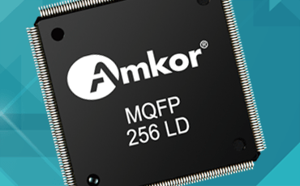
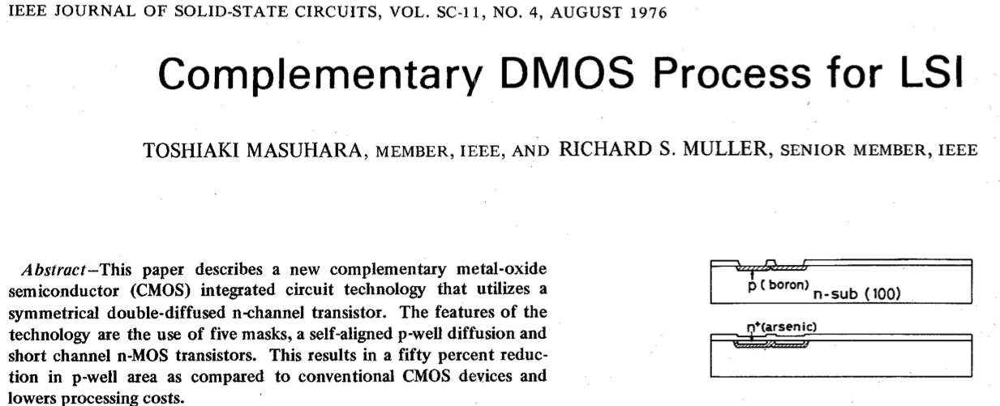
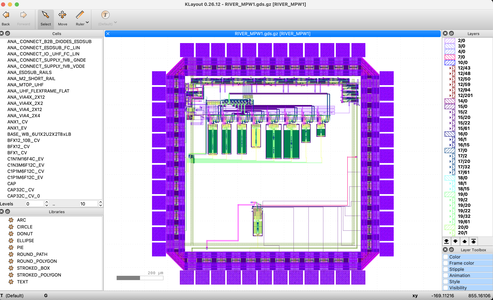

footer: Carsten Wulff 2021
slidenumbers:true
autoscale:true
theme: Plain Jane, 1
text:  Helvetica
header:  Helvetica

## TFE4152 - Lecture 2
# Manufacture Integrated Circuits

## [Source](https://github.com/wulffern/dic2021/blob/main/lectures/l2_manufacturing.md)

---

# Goal for today

* Why
* How

<!-- 
  - Wafer
  - Photolithography
  - Remove stuff
  - Add stuff
  - Cleaning
-->

* What

<!--
  - Digital flow 
  - Analog flow
-->

---

#[fit] Why

---

# Let's make a battery charger

---
# How

[.column]

- What does the use case require?
- What IC do we need?
- How is it connected to the real world?
- What pins do we need?
- What states are there?

[.column]

---

#[fit] How

---

# Printed Circuit Board (PCB)

---

[.column]

[.column]

---

- Many, many vendors 
- I know Ph.D that students have used [PCBway](https://www.pcbway.com/)
- Omega Verksted probably know best option
- Use [Altium](https://www.altium.com) to design the PCB 

---

# Package and Test

---

Many package options

Usually done by OSATS (Outsourced Semiconductor Assembly and Test)

[www.amkor.com](https://www.amkor.com)

[ase.aseglobal.com](https://ase.aseglobal.com)

---

 

Online, https://www.iue.tuwien.ac.at/phd/poschalko/img410.png

---

# Die

---

 

Picture: nRF51822 (https://s.zeptobars.com/nRF51822.jpg) 

---

# Who makes dies?

- TSMC, Globalfoundries, Samsung, UMC, SMIC ...
- Extremely high initial cost (k\$ to M\$)
- Low production cost (<< \$ per mm2)
- Sam Zeloof, made one i his garage [https://www.youtube.com/watch?v=IS5ycm7VfXg&t=3](https://www.youtube.com/watch?v=IS5ycm7VfXg&t=3)

---

# Wafer

---

### Ingot created with Czochralski Process

---
[.background-color: #000000]

# [Quantum Bound States](https://phet.colorado.edu/sims/cheerpj/bound-states/latest/bound-states.html?simulation=bound-states)

---

[.column]

> Everything should be made as simple as possible, but no simpler. (A. Einstein)

[.column]

[Crystal lattice](https://sketchfab.com/3d-models/silicon-crystal-lattice-73e292f32ffe4ca490e166faeba317e7)

---

# Photolithography

---

ArFr light source: 193 nm

Resolution: < 38 nm

Wafers per hour: > 250

Overlay: < 2.0 nm

Price: Don't know. Maybe 100 M$?

[https://www.youtube.com/watch?v=ShYWUlJ2FZs](https://www.youtube.com/watch?v=ShYWUlJ2FZs)

---

# EUV lithography

Light source : 13.5 nm
Resolution : ??
Wafers per hour : 100 ??
Price: ???

---
[.background-color: #000000]
[.text: #FFFFFF]

$$E = hf = hc/\lambda$$, where $$h = 4.1e-15 eV/Hz$$ and $$ c = 3e8$$

| Wavelength [nm] | Energy [eV] |
| :---:           | :---:       |
| 1000            | 1.2         |
| 240             | 5.1         |
| 193             | 6.4         |
| 90              | 13.6        |
| 13.5            | 91.1        |

Seems like the highest known band gap is about 13.5 eV (Lithium Fluoride) 

---

Online, https://i1.wp.com/semiengineering.com/wp-content/uploads/2016/11/Screen-Shot-2016-11-15-at-4.04.00-PM.png?w=953&ssl=1

---

---

# Remove stuff

[Etching](https://en.wikipedia.org/wiki/Etching_\(microfabrication\))

[Chemical Mechanical Polish](https://en.wikipedia.org/wiki/Chemical-mechanical_polishing)

[RCA clean](https://en.wikipedia.org/wiki/RCA_clean)

---

# Add stuff

[Thermal oxidation](https://en.wikipedia.org/wiki/Thermal_oxidation)

[Chemical vapor deposition](https://en.wikipedia.org/wiki/Chemical_vapor_deposition)

[Atomic layer deposition](https://en.wikipedia.org/wiki/Atomic_layer_deposition)

[Ion implantation](https://en.wikipedia.org/wiki/Ion_implantation)

[Diffusion](https://ieeexplore.ieee.org/stamp/stamp.jsp?tp=&arnumber=1050758)

---

# Diffusion

[.column]
[Diffusion Selfaligned MOST; A New Approach to High Speed Devices, 1969](https://confit.atlas.jp/guide/event-img/ssdm1969/4-1/public/pdf_archive?type=in)

[.column]
[Complementary DMOS Process for LSI](https://ieeexplore.ieee.org/stamp/stamp.jsp?tp=&arnumber=1050758)

---

 

---

#[fit] What

---

# GDSII (DEMO)

 

---

# How do we go from idea to GDSII?

---

#[fit] Thanks!

