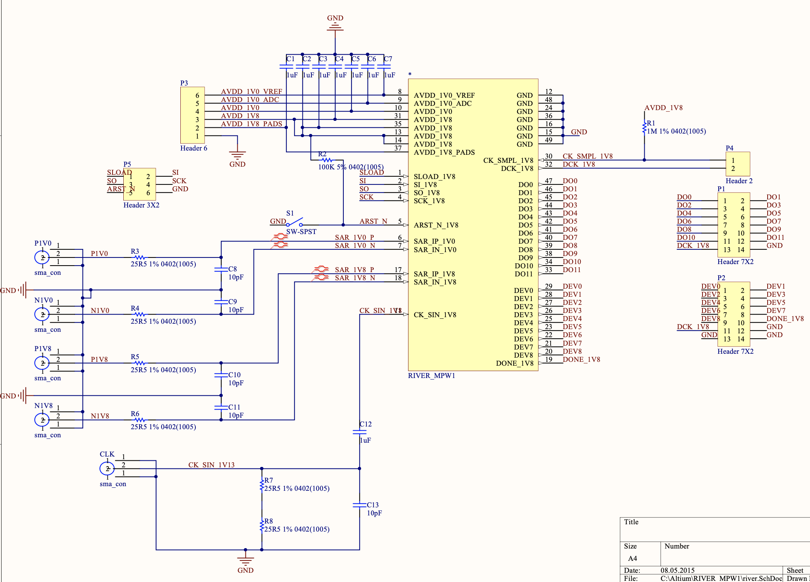

footer: Carsten Wulff 2021
slidenumbers:true
autoscale:true
theme: Plain Jane, 1
text:  Helvetica
header:  Helvetica

## TFE4152 - Lecture 2
# How are ICs made

---

# Goal for today

* Why make ICs
* How are they made

---

#[fit] Why

---

#All ICs are made for a purpose

---

---
# How

- What does the use case require?
- What IC do we need?
- How is it connected to the real world?
- What pins do we need?
- What states are there?

---

---

[.column]

[.column]

# Printed Circuit Board
- Many, many vendors 
- I know Ph.D that students have used [PCBway](https://www.pcbway.com/)
- Omega Verksted probably know best option
- Use [Altium](https://www.altium.com) to design the PCB 

---

# Package and Test

Many package options

Usually done by OSATS (Outsourced Semiconductor Assembly and Test)

[www.amkor.com](https://www.amkor.com)

[ase.aseglobal.com](https://ase.aseglobal.com)

---

 

Online, https://www.iue.tuwien.ac.at/phd/poschalko/img410.png

---

 

# Die

- TSMC, Globalfoundries, Samsung, UMC, SMIC ...
- Very, very, very, very expensive to make
- But, [Sam Zelof](https://www.youtube.com/watch?v=IS5ycm7VfXg&t=3), made one i
  his garage

Picture: nRF51822 (https://s.zeptobars.com/nRF51822.jpg) 

---

# Let me tell you a secret

---

# Why does a fab cost billions?

---
# Lithography

ArFr light source: 193 nm

Resolution: < 38 nm

Wafers per hour: > 250

Overlay: < 2.0 nm

Price: Don't know. Maybe 100 M$?

[https://www.youtube.com/watch?v=ShYWUlJ2FZs](https://www.youtube.com/watch?v=ShYWUlJ2FZs)

---

# EUV lithography

Light source : 13.5 nm
Resolution : ??
Wafers per hour : 100 ??
Price: ???

---
[.background-color: #000000]
[.text: #FFFFFF]

$$E = hf = hc/\lambda$$, where $$h = 4.1e-15 eV/Hz$$ and $$ c = 3e8$$

| Wavelength [nm] | Energy [eV] |
| :---:           | :---:       |
| 1000            | 1.2         |
| 240             | 5.1         |
| 193             | 6.4         |
| 90              | 13.6        |
| 13.5            | 91.1        |

Seems like the highest known band gap is about 13.5 eV (Lithium Fluoride) 

---

Online, https://i1.wp.com/semiengineering.com/wp-content/uploads/2016/11/Screen-Shot-2016-11-15-at-4.04.00-PM.png?w=953&ssl=1

---

---

 

---

# GDSII DEMO

 

---

[.column]
# Analog on top

[.column]

# Digital on top

---
